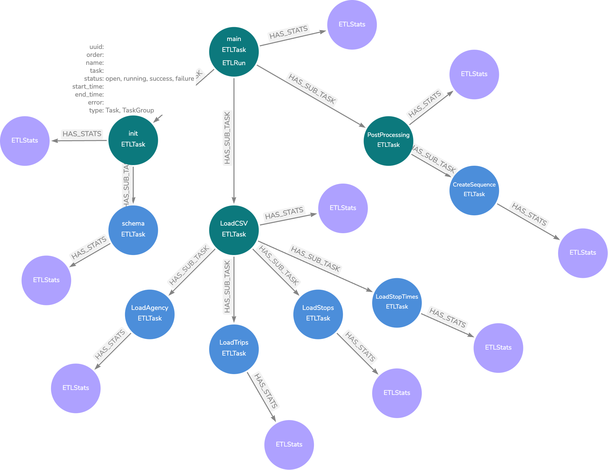

Reporting
=========

The library comes with two implementations for reporting.

..  _basic_reporter:

Basic Reporter
--------------

The :class:`~etl_lib.core.ProgressReporter.ProgressReporter` implements basic reporting using the Python logging package. Logging is done at the ``INFO`` level.

The :func:`~etl_lib.core.utils.setup_logging` function is provided to configure logging to both the console and an optional file.

The reporter is instantiated and configured inside the :class:`~etl_lib.core.ETLContext.ETLContext` constructor and can be retrieved from there.

As part of the ETL pipeline setup, a call to :func:`~etl_lib.core.ProgressReporter.ProgressReporter.register_tasks()` must be made, passing in the root of the task tree:

.. code-block:: python

    context.reporter.register_tasks(all_group)

This will log a tree representation of the tasks:

.. code-block::

    2025-02-09 13:33:42,696 - INFO -
    └──main
       ├──schema-init
       │  └──SchemaTask
       ├──csv-loading
       │  ├──LoadAgenciesTask('mdb-2333-202412230030/agency.txt')
       │  ├──LoadRoutesTask('mdb-2333-202412230030/routes.txt')
       │  ├──LoadStopsTask('mdb-2333-202412230030/stops.txt')
       │  ├──LoadTripsTask('mdb-2333-202412230030/trips.txt')
       │  ├──LoadCalendarTask('mdb-2333-202412230030/calendar.txt')
       │  └──LoadStopTimesTask('mdb-2333-202412230030/stop_times.txt')
       └──post-processing
          └──CreateSequenceTask

The :class:`~etl_lib.core.Task.Task` is responsible for informing the reporter (from the context) about status changes, such as task start and completion. This occurs before and after calls to :func:`~etl_lib.core.Task.Task.run_internal()`, ensuring that task implementations do not need to handle this manually.

At the end of each :class:`~etl_lib.core.Task.Task`, the reporter logs summary messages such as:

.. code-block::

    2025-02-09 13:43:41,535 - INFO -  finished LoadStopTimesTask('mdb-2333-202412230030/stop_times.txt') in 0:01:03.138719 with success: True
    +--------------+------------------+------------------+----------------+-------------------------+-----------------+
    |   valid_rows |   csv_lines_read |   properties_set |   labels_added |   relationships_created |   nodes_created |
    |--------------+------------------+------------------+----------------+-------------------------+-----------------|
    |      1898816 |          1898816 |          3394080 |         678816 |                 1357632 |          678816 |
    +--------------+------------------+------------------+----------------+-------------------------+-----------------+

To maintain readability, only summary information with non-zero values is reported.

Neo4j Reporter
--------------

The :class:`~etl_lib.core.ProgressReporter.Neo4jProgressReporter` extends the basic :class:`~etl_lib.core.ProgressReporter.ProgressReporter`, allowing each ETL pipeline run to be persisted in a Neo4j database.

Which implementation is used depends on the existence of the key ``REPORTER_DATABASE`` in ``context.env``. This ``env`` dictionary should be built from the process environment.

If the ``REPORTER_DATABASE`` key exists, its value determines the database where ETL status information is stored, enabling separation between application data and ETL metadata.

Each ETL run creates an independent subgraph. The following diagram illustrates the structure of such a subgraph for a GTFS example:

Green nodes represent :class:`~etl_lib.core.Task.Task`, while blue nodes represent :class:`~etl_lib.core.Task.TaskGroups`.

``ETLStats`` nodes are created upon task completion and store summary information. For tasks with child tasks, the ``ETLStats`` node aggregates data from all children. To view the overall summary for a pipeline run, refer to the ``ETLStats`` node attached to the ``ETLRun`` node.

Unlike the :ref:`basic_reporter`, which only logs non-zero values, ``ETLStats`` nodes store all summary data, including zero values.

The project's root directory includes a ``dashboard.json`` file for use with `Neodash Dashboard Builder <https://github.com/neo4j-labs/neodash>`_.

.. ATTENTION::
    The Neo4j reporter does not automatically create constraints for metadata. To manually create the constraint, execute the following Cypher query:

    .. code-block:: cypher

        CREATE CONSTRAINT IF NOT EXISTS FOR (n:ETLTask)
            REQUIRE n.uuid IS UNIQUE

    Alternatively, the :class:`~etl_lib.task.CreateReportingConstraintsTask.CreateReportingConstraintsTask` can be added at the start of a pipeline to ensure the constraint is created if it does not exist.

Additionally, :doc:`cli` provides details on using the command-line interface to query and manage ETL run history.
