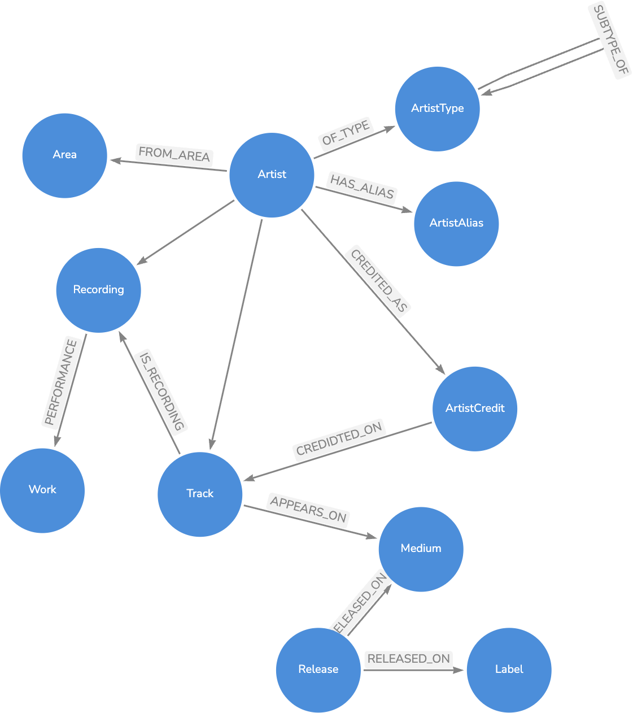
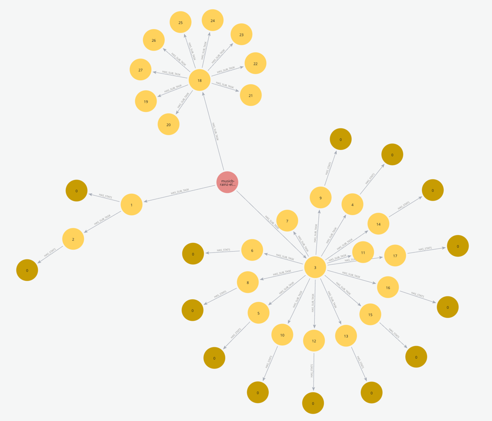

# Example ETL Pipeline: Import MusicBrainz Data into Neo4j

This example demonstrates how to extract data from a local copy of the MusicBrainz PostgreSQL database and load it into Neo4j.

Since MusicBrainz does not provide direct read-only access to their production database, you must run your own instance locally. We recommend using the official Docker setup: https://github.com/metabrainz/musicbrainz-docker.


## Configuration

You can supply connection parameters for PostgreSQL and Neo4j via command-line options or a `.env` file. See `.env.sample` for the required variables.

## Usage

First, initialize the schema (constraints and indexes) and then import data by running:

`python examples/musicbrainz/src/musicbrainz.py import`

For examples of task implementations, see:

* SchemaTask – creates constraints & indexes
* LoadNodesTask – parallel node loading
* LoadRelationships – relationship creation

## Graph Model

This demo closely mirrors the MusicBrainz data model but does not transfer every table or field. It exists purely for illustration.

See for the resulting graph.

## Pipeline Stages

1. Schema Initialization
    * Runs SchemaTask to add constraints and indexes.

2. Nodes Loading
    * Loads selected tables into Neo4j nodes in parallel.

3. Relationships Loading
    * Establishes relationships between nodes according to foreign keys.

The following diagram shows the task hierarchy generated by the reporter:



The same structure can be seen by the console output:

```
└──musicbrainz-etl
   ├──schema-init
   │  ├──CreateReportingConstraintsTask
   │  └──MusicBrainzSchemaTask
   ├──nodes-loading
   │  ├──LoadArtistTask
   │  ├──LoadArtistAliasTask
   │  ├──LoadArtistCreditTask
   │  ├──LoadTrackTask
   │  ├──LoadMediumTask
   │  ├──LoadReleaseTask
   │  ├──LoadLabelTask
   │  ├──LoadRecordingTask
   │  ├──LoadWorkTask
   │  ├──LoadAreaTask
   │  ├──LoadArtistTypeTask
   │  ├──LoadAreaTypeTask
   │  ├──LoadWorkTypeTask
   │  └──LoadMediumFormatTask
   └──relationship-loading
      ├──CreateArtistAliasRelTask
      ├──CreateArtistCreditRelTask
      ├──CreateArtistToAreaRelTask
      ├──CreateCreditOnTrackRelTask
      ├──CreateMediumToReleaseRelTask
      ├──CreateRecordingToWorkRelTask
      ├──CreateReleaseToLabelRelTask
      ├──CreateTrackToMediumRelTask
      └──CreateTrackToRecordingRelTask

2025-05-16 09:55:47,642 - INFO - starting musicbrainz-etl
2025-05-16 09:55:47,656 - INFO - starting schema-init
2025-05-16 09:55:47,658 - INFO - starting CreateReportingConstraintsTask
2025-05-16 09:55:47,667 - INFO - finished CreateReportingConstraintsTask in 0:00:00.008295 with success: True
2025-05-16 09:55:47,687 - INFO - starting MusicBrainzSchemaTask
2025-05-16 09:55:48,024 - INFO - finished MusicBrainzSchemaTask in 0:00:00.336079 with success: True
+---------------------+-----------------+
|   constraints_added |   indexes_added |
|---------------------+-----------------|
|                  14 |              15 |
+---------------------+-----------------+
2025-05-16 09:55:48,050 - INFO - finished schema-init in 0:00:00.393860 with success: True
+---------------------+-----------------+
|   constraints_added |   indexes_added |
|---------------------+-----------------|
|                  14 |              15 |
+---------------------+-----------------+
2025-05-16 09:55:48,053 - INFO - starting nodes-loading
2025-05-16 09:55:48,065 - INFO - starting LoadArtistTask
2025-05-16 09:55:48,066 - INFO - starting LoadArtistAliasTask
2025-05-16 09:55:48,066 - INFO - starting LoadArtistCreditTask
2025-05-16 09:55:48,067 - INFO - starting LoadTrackTask
2025-05-16 09:55:48,067 - INFO - starting LoadMediumTask
2025-05-16 09:55:48,067 - INFO - starting LoadReleaseTask
2025-05-16 09:55:48,068 - INFO - starting LoadLabelTask
2025-05-16 09:55:48,069 - INFO - starting LoadRecordingTask
2025-05-16 09:55:48,069 - INFO - starting LoadWorkTask
2025-05-16 09:55:48,070 - INFO - starting LoadAreaTask
2025-05-16 09:55:48,070 - INFO - starting LoadArtistTypeTask
2025-05-16 09:55:48,073 - INFO - starting LoadAreaTypeTask
2025-05-16 09:55:48,073 - INFO - starting LoadWorkTypeTask
2025-05-16 09:55:48,075 - INFO - starting LoadMediumFormatTask
2025-05-16 09:55:48,366 - INFO - finished LoadArtistTypeTask in 0:00:00.295554 with success: True
+----------------+------------------+-----------------+-----------------+
|   labels_added |   properties_set |   sql_rows_read |   nodes_created |
|----------------+------------------+-----------------+-----------------|
|              6 |               12 |               6 |               6 |
+----------------+------------------+-----------------+-----------------+

<..snip..>

2025-05-16 12:25:16,696 - INFO -  finished musicbrainz-etl in 3:36:33.810144 with success: True
+---------------------+-----------------+------------------+-----------------+----------------+-----------------++-------------------------+-----------------+
|   constraints_added |   nodes_created |   properties_set |   indexes_added |   labels_added |   sql_rows_read |   relationships_created |   sql_rows_read |
|---------------------+-----------------+------------------+-----------------+----------------+-----------------|-------------------------+-----------------|
|                  14 |       104293374 |        427518068 |              15 |      104293374 |       104293374 |                41486332 |       173906088 |
+---------------------+-----------------+------------------+-----------------+----------------+-----------------+-------------------------+-----------------+
```

## CLI Commands

The main script includes built-in CLI commands (via `etl_lib.cli.run_tools`) to manage ETL runs:

```
python examples/musicbrainz/src/musicbrainz.py  --help
Usage: musicbrainz.py [OPTIONS] COMMAND [ARGS]...

  Command-line tool for ETL pipelines.

  Environment variables can be configured via a .env file or overridden via
  CLI options:

  - NEO4J_URI: Neo4j database URI
  - NEO4J_USERNAME: Neo4j username
  - NEO4J_PASSWORD: Neo4j password
  - LOG_FILE: Path to the log file
  - DATABASE_NAME: Neo4j database name (default: neo4j)

Options:
  --neo4j-uri TEXT       Neo4j database URI
  --neo4j-user TEXT      Neo4j username
  --neo4j-password TEXT  Neo4j password
  --log-file TEXT        Path to the log file
  --database-name TEXT   Neo4j database name (default: neo4j)
  --help                 Show this message and exit.

Commands:
  delete  Delete runs based on run ID, date, or age.
  detail  Show a breakdown of the task for the specified run, including...
  import  Imports MusicBrainz data from PostgreSQL to Neo4j.
  query   Retrieve the list of the last x ETL runs from the database and...
```

And for the import command:
```
python examples/musicbrainz/src/musicbrainz.py import  --help
Usage: musicbrainz.py import [OPTIONS]

  Imports MusicBrainz data from PostgreSQL to Neo4j.

Options:
  --pg-host TEXT      PostgreSQL host
  --pg-port INTEGER   PostgreSQL port
  --pg-database TEXT  PostgreSQL database name
  --pg-user TEXT      PostgreSQL username
  --pg-password TEXT  PostgreSQL password
  --help              Show this message and exit.
```

Sample output of the query command:
```
python examples/musicbrainz/src/musicbrainz.py query
Listing runs in database 'neo4j'
+--------+--------------------------------------+------------------+------------------+-----------+
| name   | ID                                   | startTime        | endTime          |   changes |
|--------+--------------------------------------+------------------+------------------+-----------|
| main   | 08e84ddc-d315-4259-961d-a552d097c7cb | 2025-03-19 16:51 | 2025-03-19 16:51 |    140791 |
| main   | d7030540-65c8-4f41-97b9-e01a5014fb19 | 2025-03-19 16:14 |                  |         0 |
| main   | 8efcb86a-f570-41fe-a792-e44d2f1531c3 | 2025-03-18 22:23 | 2025-03-18 22:23 |    140891 |
| main   | 464b2270-68c5-4121-b714-01d77deedc27 | 2025-03-18 14:24 | 2025-03-18 17:50 |  69292135 |
| main   | d9dd47e7-fbf2-4844-9e55-bbdda54168df | 2025-03-18 14:23 |                  |         0 |
| main   | b9f3faae-4884-4785-820b-e8b546c52e95 | 2025-03-11 09:40 | 2025-03-11 09:51 |  69292135 |
| main   | ef62adcc-a6f1-4565-a737-44d432d6a040 | 2025-03-06 11:48 | 2025-03-06 11:59 |  69292135 |
| main   | e3a92e41-f153-42dc-bd6b-348b564fa893 | 2025-03-02 16:43 | 2025-03-02 16:55 |  69292135 |
| main   | 98d143eb-1011-4348-9ab1-8ed34e193b0e | 2025-02-28 16:14 | 2025-02-28 16:26 |  69386739 |
| main   | 68a4ed9e-b3af-41de-9fbc-b102fc0cdcb8 | 2025-02-28 15:40 | 2025-02-28 15:52 |  71171473 |
+--------+--------------------------------------+------------------+------------------+-----------+
```
